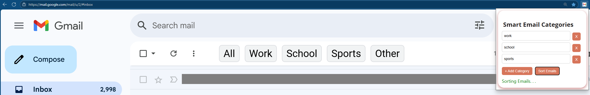
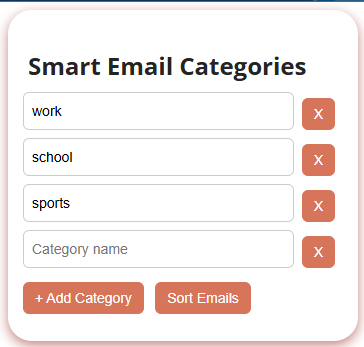

# Smart Gmail Sorter

### This is a chrome extension that utilizes LLMs to categorize a user's Gmail emails into smart user-defined labels by scraping visible inbox content

### ✨ Features
- AI-powered email classification (using DeepSeek v3 0324 via OpenRouter)
- DOM-based scraping — **no user authentication or Gmail API**
- Customizable categories (e.g. Work, School, Promotions)
- Dynamic clickable buttons injected into Gmail UI for fast filtering

### 🔄 How It Works

1. Input as many categories as desired to categorize your Gmail into
2. Click "Sort Emails" in the extension popup
3. The extension extracts all email snippets and sender information from the loaded tab
4. The data is sent to an LLM (DeepSeek v3) for classification using an OpenRouter API key
5. Gmail rows are tagged with their predicted category
6. Category filter buttons are injected in the Gmail toolbar for the user to change categories

### 🔧 Technologies
- JavaScript (ES6+)
- HTML/CSS
- Chrome Extensions (Manifest V3)
- OpenRouter or LLM backend
- Gmail DOM scraping 

### Troubleshooting
- Initially this project was intended to Gmail API and fetch email information. However, I came to the realization that the legacy ID's did not match those on Gmail's HTML.
  I pivoted to extracting information visible on the user's DOM, this also dismisses the need to use OAuth 3.0

- This project was struggling to create accurate results, as the LLMs would hallucinate fake categories and forget several emails. This had to be balanced with the low token limit I had using a free API.
I decided to batch emails in sets of 8-10, in order to reduce the amount of fetches required, but also keep the prompt short enough to not confuse the LLM. I also pivoted from using Meta's LLaMA, which was fast but very inaccurate, to using DeepSeek v3 0324, which was slower, but much more accurate.
